# System Services

This directory contains documentation for each system service running on the scooter. Each service is documented individually with its Redis operations, external interfaces, and behavior patterns.

## LibreScoot Services

LibreScoot provides open-source replacement services for the unu Scooter Pro. For a comprehensive overview of all LibreScoot services, their features, and architecture, see **[LibreScoot Services Documentation](librescoot-services.md)**.

## LibreScoot Service Overview

| Service | Purpose | Redis Hashes Written | Key Dependencies |
|---------|---------|----------------------|------------------|
| [librescoot-bluetooth](librescoot-bluetooth.md) | BLE interface and nRF communication | `ble`, `cb-battery`, `aux-battery`, `power-manager`, `power-mux`, `system` | nRF52840 (UART), Redis |
| [librescoot-battery](librescoot-battery.md) | Main battery monitoring via NFC | `battery:0`, `battery:1` | PN7150 NFC readers (I2C), Redis |
| [librescoot-vehicle](librescoot-vehicle.md) | Vehicle state machine coordinator | `vehicle` | GPIO inputs, PWM outputs, Redis |
| [librescoot-ecu](librescoot-ecu.md) | Motor controller interface | `engine-ecu` | ECU (CAN bus), Redis |
| [librescoot-keycard](librescoot-keycard.md) | NFC keycard authentication | `keycard` | PN7150 (I2C), LP5662 LED (I2C), Redis |
| [librescoot-modem](librescoot-modem.md) | Cellular and GPS | `internet`, `gps`, `modem` | ModemManager, gpsd, Redis |
| [librescoot-pm](librescoot-pm.md) | System power management | `power-manager` | systemd-logind (D-Bus), Redis |
| [librescoot-scootui](librescoot-scootui.md) | Primary user interface | `dashboard` | All services (via Redis) |
| [librescoot-alarm](librescoot-alarm.md) | Motion-based alarm system | `alarm`, `bmx` | BMX055 (I2C), Redis |
| [librescoot-settings](librescoot-settings.md) | Persistent settings sync | `settings` | NetworkManager, Redis |

## Service Architecture

```mermaid
graph TB
    UI["scootui<br/>Qt/QML UI on DBC"]
    Redis["Redis<br/>Pub/Sub + Hashes + Lists"]

    PM["pm-service<br/>Power Management"]
    BT["bluetooth-service<br/>BLE Interface"]
    VH["vehicle-service<br/>State Machine"]
    ECU["ecu-service<br/>Motor Control"]
    KC["keycard-service<br/>NFC Auth"]
    BAT["battery-service<br/>Battery Monitor"]
    MDM["modem-service<br/>Cellular + GPS"]
    ALM["alarm-service<br/>Motion Alarm"]
    SET["settings-service<br/>Config Sync"]

    LOGIND["systemd-logind<br/>D-Bus"]
    NRF["nRF52840<br/>UART"]
    GPIO["GPIO/PWM<br/>Inputs/Outputs"]
    CAN["ECU Motor Controller<br/>CAN Bus"]
    NFC1["PN7150 + LP5662<br/>NFC + LED via I2C"]
    NFC2["PN7150 x2<br/>Battery NFC via I2C"]
    MODEM["ModemManager<br/>mmcli + gpsd"]
    BMX["BMX055<br/>Accelerometer/Gyro via I2C"]
    TOML["settings.toml<br/>Persistent Config"]

    UI <--> Redis
    PM <--> Redis
    BT <--> Redis
    VH <--> Redis
    ECU <--> Redis
    KC <--> Redis
    BAT <--> Redis
    MDM <--> Redis
    ALM <--> Redis
    SET <--> Redis

    PM <--> LOGIND
    BT <--> NRF
    VH <--> GPIO
    ECU <--> CAN
    KC <--> NFC1
    BAT <--> NFC2
    MDM <--> MODEM
    ALM <--> BMX
    SET <--> TOML
```

## Service Communication Patterns

### Event Publishing
Services publish events to Redis channels when state changes:
- `PUBLISH <hash-name> <field>` notifies subscribers of field changes
- Individual fields may publish separately (e.g., `PUBLISH vehicle state`)
- Dashboard and other services subscribe to relevant channels

### Command Lists
Command producer services use LPUSH, consumer services use BRPOP:
- **Producers**: `bluetooth-service` (from BLE commands) → LPUSH to `scooter:*` lists
- **Consumers**: `vehicle-service` → BRPOP from `scooter:state`, `scooter:seatbox`, `scooter:horn`, `scooter:blinker`
- Example: `LPUSH scooter:state lock` queues a vehicle lock command

### State Storage
Services store state in Redis hashes:
- `HSET vehicle state ready-to-drive` - Update vehicle state
- `HGETALL vehicle` - Read all vehicle fields
- Services only write to their own hashes (see table above)

### Key Service Relationships
- **battery-service** is independent - monitors batteries via NFC, writes to `battery:0/1`, subscribes to `vehicle:state` and `vehicle:seatbox:lock`
- **bluetooth-service** reads from `battery:*` and `vehicle` but doesn't write to them
- **vehicle-service** reads from `battery:*`, `dashboard`, `keycard` but doesn't write to them
- **Power management** fields in `power-manager` are written by both `pm-service` and `bluetooth-service` (nRF-related fields)
- **alarm-service** monitors `vehicle` state and controls `bmx` sensor, sends commands to `scooter:horn` and `scooter:blinker`
- **settings-service** syncs Redis `settings` hash with `/data/settings.toml` and manages NetworkManager connections

## Service Lifecycle

### Startup
1. Service connects to Redis (typically 192.168.7.1:6379)
2. Initializes hardware interfaces
3. Writes initial state to Redis hash
4. Starts BRPOP loops for command lists (if applicable)
5. Publishes initial state update

### Runtime
- Polls hardware at service-specific intervals
- Updates Redis hash fields on state changes
- Publishes to Redis channel on updates
- Processes commands from Redis lists

### Shutdown
- Cleanup handled by systemd
- No graceful shutdown protocol observed

## Cross-Service Dependencies

### Critical Path for "Ready to Drive"
1. nRF52840 powers on system (brake lever or other wakeup)
2. `battery-service` detects batteries
3. `keycard-service` authenticates user
4. `vehicle-service` transitions to ready-to-drive
5. `scootui` displays status

### Power Management Flow
1. `vehicle-service` requests shutdown
2. `pm-service` manages suspend/hibernate
3. `modem-service` disabled by pm-service before hibernation
4. nRF52 controls power mux
5. System enters low-power state

## Service Configuration

All services are managed by systemd:
- Service files in `/etc/systemd/system/`
- Started via `systemctl start <service>`
- Logs via `journalctl -u <service>`

See individual service documentation for specific configuration details.
